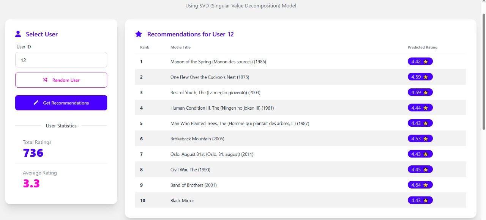

# SVD Model & TensorFlow Model

Models can be obtained via Git LFS or Google Drive:
*   **SVD Model:** https://drive.google.com/file/d/1UTEVAmg7RdorC231e2R4ITN7A5pezq2t/view?usp=sharing (700 MB)
*   **TensorFlow Model:** https://drive.google.com/file/d/1F__a1KArIyPbtFN-IhOkaO4T_8MeBO5C/view?usp=sharing (100MB)

# Rekomendasi Film

Proyek ini adalah sistem rekomendasi film yang memberikan rekomendasi film kepada pengguna berdasarkan peringkat yang telah mereka berikan sebelumnya. Sistem ini menggunakan dua pendekatan *collaborative filtering*: **SVD (Singular Value Decomposition)** dan **Matrix Factorization dengan TensorFlow**. Aplikasi ini dibangun dengan Flask dan dapat diakses melalui antarmuka web atau REST API.

## Fitur

*   **Rekomendasi Multi-Model:** Dapatkan rekomendasi menggunakan model SVD atau TensorFlow.
*   **Rekomendasi Berbasis Pengguna:** Dapatkan rekomendasi film untuk pengguna tertentu.
*   **Statistik Pengguna:** Lihat statistik peringkat pengguna dan film dengan peringkat tertinggi dari mereka.
*   **REST API:** Akses mesin rekomendasi secara terprogram.
*   **Antarmuka Web:** Antarmuka web sederhana untuk berinteraksi dengan sistem rekomendasi.

## Teknologi yang Digunakan

*   **Python:** Bahasa pemrograman inti.
*   **Flask:** Kerangka kerja web mikro untuk aplikasi web dan API.
*   **Pandas & NumPy:** Untuk manipulasi dan analisis data.
*   **scikit-surprise:** Untuk membangun model SVD.
*   **TensorFlow/Keras:** Untuk membangun model rekomendasi berbasis Matrix Factorization.
*   **scikit-learn:** Untuk pemrosesan data seperti `LabelEncoder`.
*   **Joblib:** Untuk menyimpan dan memuat model SVD.
*   **Conda:** Untuk manajemen lingkungan.

## Pengaturan dan Instalasi

1.  **Clone repositori:**
    ```bash
    git clone https://github.com/username-anda/film-recommender.git
    cd film-recommender
    ```

2.  **Buat dan aktifkan lingkungan Conda:**
    Pastikan file `recommender-env.yml` Anda berisi semua dependensi yang diperlukan, termasuk `tensorflow`.
    ```bash
    conda env create -f recommender-env.yml
    conda activate recommender-env
    ```

3.  **Unduh Model:**
    Unduh file model (`svd_model.joblib` dan `tf_model.keras`) dari tautan di atas dan letakkan di dalam direktori `models/`.

4.  **Jalankan aplikasi Flask:**
    ```bash
    python app.py
    ```
    Aplikasi akan berjalan di `http://127.0.0.1:5000`.

## Penggunaan

### Antarmuka Web

Buka `http://127.0.0.1:5000` di browser web Anda. Anda dapat memilih ID pengguna dari menu dropdown untuk melihat informasi mereka dan mendapatkan rekomendasi film. Antarmuka web mungkin memiliki opsi untuk memilih model yang akan digunakan.

### Endpoint API

*   **GET /api/users**
    *   Mengembalikan daftar semua ID pengguna yang tersedia.

*   **GET /api/user/<user_id>/info**
    *   Mengembalikan informasi tentang pengguna tertentu, termasuk jumlah total peringkat, peringkat rata-rata, dan daftar 10 film dengan peringkat teratas dari mereka.

*   **GET /api/recommend/<user_id>**
    *   Mengembalikan daftar 10 rekomendasi film untuk pengguna yang ditentukan.
    *   **Query Parameter:** `model` (opsional, default: `svd`)
        *   `svd`: Menggunakan model SVD untuk rekomendasi.
        *   `tf`: Menggunakan model TensorFlow untuk rekomendasi.
    *   **Contoh:**
        *   `GET /api/recommend/1?model=svd`
        *   `GET /api/recommend/1?model=tf`

## Deskripsi File

*   **`app.py`**: File utama aplikasi Flask. Berisi endpoint API, logika untuk kedua model rekomendasi (SVD dan TensorFlow), dan menyajikan antarmuka web.
*   **`recommender.ipynb`**: Jupyter Notebook yang digunakan untuk melatih model SVD.
*   **`tensorflow_recommender.ipynb`**: Jupyter Notebook yang digunakan untuk melatih model Matrix Factorization dengan TensorFlow.
*   **`recommender-env.yml`**: File lingkungan Conda, yang berisi daftar semua dependensi yang diperlukan.
*   **`models/svd_model.joblib`**: Model SVD yang sudah dilatih sebelumnya.
*   **`models/tf_model.keras`**: Model TensorFlow yang sudah dilatih sebelumnya.
*   **`data/`**: Direktori ini berisi file dataset MovieLens (`movies.csv` dan `ratings.csv`).
*   **`templates/index.html`**: Template HTML untuk antarmuka web.
*   **`.gitignore`**: Menentukan file dan direktori mana yang akan diabaikan di Git.
*   **`.gitattributes`**: File atribut Git.
